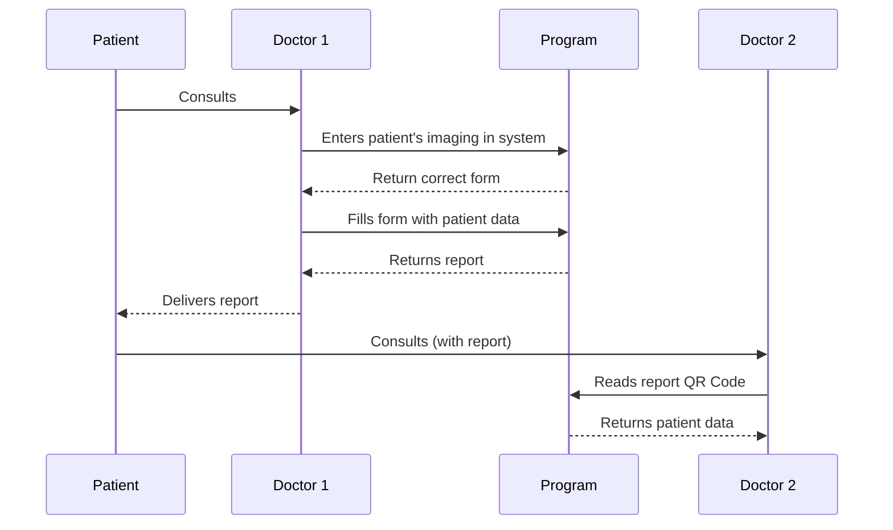
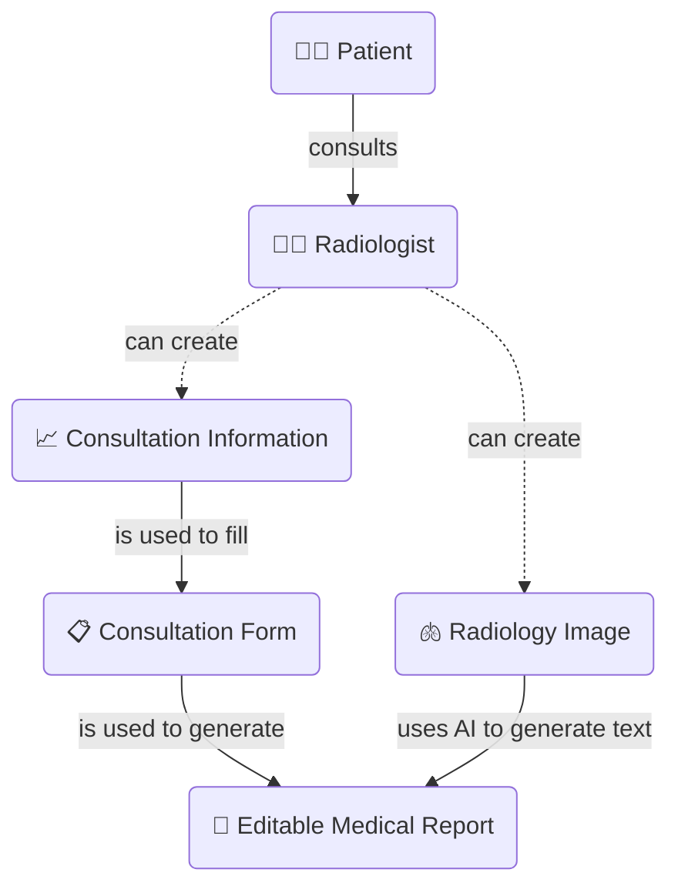
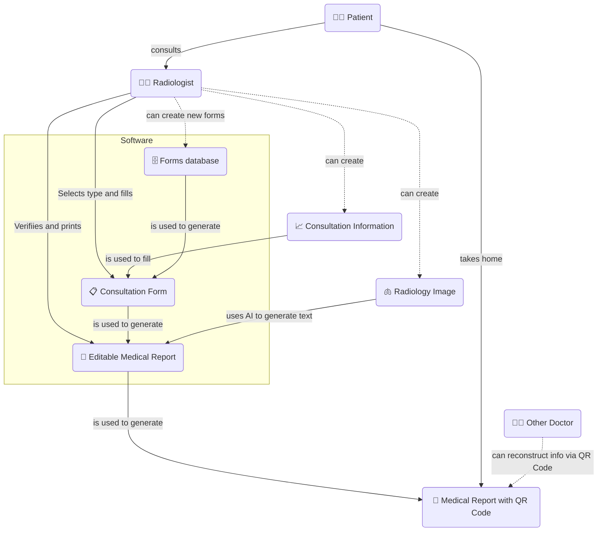

# Avaliação A3
**MC426** Report on 21/05/2023

 1. [Elicitação de Requisitos](#1-elicitação-de-requisitos)
	 1. [Brainstorming](#11-brainstorming-e-cen%C3%A1rios-de-uso)
	 2. [Benchmarking](#12-benchmarking)
	 3. [Entrevistas (método principal)](#13-entrevistas)
 2. [Histórias](#2-hist%C3%B3rias)

## 1. Elicitação de Requisitos

Para a elicitação de requisitos desse projeto, decidimos utilizar 3 diferentes métodos: entrevistas, brainstorming e benchmarking. Cada um dos 3 métodos e seus resultados serão explicados abaixo.

### 1.1 Brainstorming e Cenários de uso:

Considere os seguintes cenários:

> - Eu, como médico, quero poder acessar um registro de exames do paciente sem precisar armazenar fisicamente ou solicitar ao paciente  que armazene os exames.
> - Eu, como médico, quero um modo seguro e prático de realizar um prontuário de um paciente.
> - Eu, como médico, quero um modo seguro e prático de analisar um exame de um paciente.

Como explicado anteriormente, o projeto começou baseado no artigo do do [ICIPEMIR](https://pubmed.ncbi.nlm.nih.gov/34042778/), que prevê um sistema de intercompatibilidade de prontuários médicos utilizando QR Codes.

A principal vantagem dessa abordagem é em que nenhum momento os dados do usuário ficarão guardados em um banco de dados (um dos principais entraves legais quando falamos de intercompatibilidade médica), mas com um leitor e escritor de QR Codes podemos rapidamente transmitir dados médicos para devices/prontuários impressos e reconstrui-los lendo-os novamente no sistema.

Outro objetivo do sistema é facilitar a criação de prontuários médicos a partir de consultas, especialmente imagens de radiologia. Essa parte será explicada mais a fundo na área de benchmarking.

Iniciamos nosso brainstorm pensando em como seria a interação entre os médicos e usuário:

**Diagrama 1.** Interação esperada entre o software, e seus usuários: o paciente e os médicos.

E abaixo, uma forma simplificada de como o sistema funcionaria

**Diagrama 2.** Visão simplificada do uso do programa.

Ou seja, após uma consulta, o médico irá simplesmente preencher a informação do usuário (ou a imagem do exame de radiologia) no software e receberá um prontuário editável com um QR Code com as informações preenchidas. Uma versão mais completa do uso pode ser vista abaixo:

**Diagrama 3.** Visão completa do sistema

Idealmente, no brainstorm consideramos que para o usuário (radiologista), o programa poderia ser *stateless*, isto é, ele não necessitaria nem de login e bastaria clicar alguns botões para já ter o formulário disponível, mas devido à necessidade auto-imposta de um número mínimo de features como login e signup (devido aos requisitos da matéria de engenharia de Software), esse não é o caso.

Idealmente o software é dividido em duas partes quase inteiramente separadas: o módulo frontend e o módulo backend, de forma que diferentes consultórios pudessem fazer um deploy do backend customizado (por exemplo, se eles desejam ter um banco de dados de formulários único) sem a necessidade de alterar o frontend. Isso poderia ser feito por meio de uma configuração do usuário na chamada de API do frontend.

A idéia de ter uma IA geradora de textos médicos veio da pesquisa do benchmarking, mas ela ainda está sendo considerada como uma feature que não estará presente devido à falta de datasets para treina-la. Se ela vier a ser presente, será em uma forma reduzida.

### 1.2 Benchmarking
O primeiro passo da nossa pesquisa de benchmarking depende em esclarecer o objetivo do nosso software: _(i) criar um gerador automático de prontuários médicos_ **e** _(ii) ser capaz de escrever e ler informações de um paciente de forma fácil e digital, sem a necessidade de guardar as informações do paciente em uma base de dados centralizada._

Não encontramos nada muito parecido que satisfazesse a necessidade (ii), e para a necessidade (i) separamos em 2 partes: (a) estudos/frameworks que auxiliam nesse objetivo e (b) softwares off-the-shelf que oferecem automação de prontuários médicos.

Para o caso (a) sabemos que [openEHR](https://openehr.org/) e [HL7](https://www.hl7.org/) oferecem standards para informática médica - enquanto há vários estudos sobre o uso de [LSTMs](https://journals.plos.org/plosone/article?id=10.1371/journal.pone.0262209) e outros [modelos de IA](https://paperswithcode.com/paper/automated-radiology-report-generation-using) para geração de texto a partir de imagems de radiologia (porém, nenhum desses estudos apresenta um software para radiologistas usarem) e até mesmo um estudo sobre como automatizar [a leitura de prontuários médicos](http://koreascience.or.kr/article/JAKO201211666470459.pdf). Para os estudos, este [link](https://paperswithcode.com/task/medical-report-generation) possui uma lista de artigos úteis.

Para o ponto (b), foram poucos os softwares que de fato foram capazes de satisfazer os critérios de busca, e não achamos nenhum que fóssemos capaz de experimentar sem precisar comprar o software. Por exemplo:
-  [TheFormTool](https://www.theformtool.com/lp/medical/) diz ser capaz criar prontuários médicos e "acelerar em 70%" a papelada, no entando não achamos nem imagens claras de como ele poderia ser usado para isso.
- [Care2Report](https://care2report.nl/) é uma iniciativa da universidade de Utrecht de automatizar relatórios médicos, tomando em conta também vídeos, áudios e outras entradas para a geração de formulários, no entando eles não providenciam uma plataforma para usar essas tecnologias.
- [Jotform](https://www.jotform.com/form-templates/health/medical-surveys-and-questionnaires) e outras plataformas similares são o equivalente a um Google Forms avançado, e apesar deles serem amigáveis ao usuário, eles não são de fato feitos para esse tipo de trabalho.

Devido à esses fatores, acabamos por não fazer todos os passos do benchmarking (como capturar screenshots), portanto o benchmarking 
acaba por ficar "incompleto". Em conclusões gerais, percebemos a falta de um software simples e fácil capaz de cumprir a automação de formulários médicos, principalmente de um _Software Livre[*](https://en.wikipedia.org/wiki/Free_software)_

### 1.3 Entrevistas:

Para este projeto, usamos entrevistas como uma técnica de listagem de requisitos. Como infelizmente não conseguimos marcar com nenhum médico atuante, decidimos entrevistar Prof. André Santanché, pesquisador e professor da Universidade Estadual de Campinas - cuja pesquisa é focada principalmente em e-Saúde e Engenharia de Software aplicada à saúde - ([link para o áudio da entrevista](https://drive.google.com/file/d/1CnRjaXXXcn0A8ORXIMo-f7BFV3Npeht2/view?usp=share_link)*) e Pedro Merrotti, aluno de radiologia da UTFPR. Também tivemos uma troca de idéias por email com um dos autores do artigo: Dr. Arthur Lauriot dit Prevost.

A estrutura das entrevistas foram feitas de uma forma de indução: primeiro começamos abordando o que de fato para contextualização e perguntamos de forma bem geral sobre o campo de automação de prontuários médicos, para depois voltar à especializar as perguntas para o projeto.

**Tabela 1.** Perguntas planejadas para as entrevistas. Devido ao tempo, nem todas as perguntas foram feitas nas entrevistas.
| **Fase** | **Tipo** | **Pergunta** |
|---|---|---|
| Introdução | Explicação | [Começamos com uma leve explicação de que estamos fazendo um projeto de automação de prontuários médicos] |
| Introdução | Subjetiva | O que você entende por automação de prontuários médicos? |
| Introdução | Subjetiva | Quais são as maiores dificuldades encontradas na análise de exames prescritos aos pacientes? |
| Introdução | Subjetiva | Você acredita que um software de automação de prontuários médicos adicionaria valor na área? |
| Introdução | Subjetiva | Quais os principais problemas enfrentados na área de intercompatibilidade médica? |
| Introdução | Subjetiva | Na sua visão, quais seriam as soluções para intercompatibilidade de prontuários médicos? |
| Introdução | Aprofundamento | [Perguntas de aprofundamento nas respostas dadas pelo entrevistado, como por exemplo, se aprofundar nos problemas] |
| Aprofundamento | Explicação | [Aqui há uma explicação mais detalhada do sistema, como mostrado com os diagramas acima] |
| Aprofundamento | Objetiva | Quanto tempo é gasto na geração de prontuários médicos? |
| Aprofundamento | Objetiva | Quanto tempo é gasto na leitura e extração de prontuários médicos? |
| Aprofundamento | Objetiva | Para pacientes recorrentes, quanto tempo é gasto adquirindo as mesmas informações já adquiridas em outras consultas? |
| Aprofundamento | Objetiva | Para pacientes novos, quanto tempo é gasto adquirindo informações básicas e outras consultas de outros médicos? |
| Aprofundamento | Objetiva | Quem seriam os principais usuários de um sistema desse? |
| Aprofundamento | Objetiva | A proposta do sistema de ser Libre e Open-Source adiciona valor para a comunidade? |
| Aprofundamento | Objetiva | O uso de algoritmos para pré-geração de prontuários adiciona valor para os consultórios que o utilizariam? |
| Aprofundamento | Objetiva | Você usaria um sistema de geração de prontuários com Inteligência Artificial?  |
| Feedback | Subjetiva | Quais os cenários de uso que você vê para uma ferramenta como essa? |
| Feedback | Subjetiva | Quais as principais vantagens de uma ferramenta como essa? |
| Feedback | Subjetiva | Quais as principais desvantagens de uma ferramenta como essa? |
| Feedback | Subjetiva | Quais outros métodos você vê como soluções para a geração e intercompatibilidade de prontuários médicos? |
| Feedback | Objetiva | [Outras perguntas objetivas, dependendo do nível de conhecimento do entrevistado em determinado assunto da área] |
| Feedback | Aprofundamento | [Outras perguntas de aprofundamento, dependendo da resposta do usuário anteriormente] |
| Conclusão | Subjetiva | Há mais algum ponto do assunto que você acha importante que seja adicionado no projeto? |
| Conclusão | Objetiva | Há outras pessoas que você recomendaria que fossem entrevistadas? |
| Conclusão | Subjetiva | Na sua opinião, quais os passos seguintes no projeto? |

*OBS: Só lembramos de gravar o áudio após um tempo de entrevista, então algumas informações iniciais foram perdidas.

## 2. Histórias
