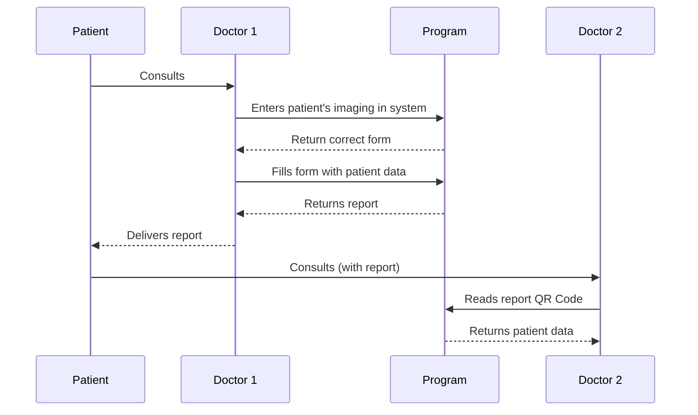

# MC426 👩‍⚕️ 
##### An Open-Source, Smart and Friendly Medical Report Generator


## Technical Details
  
This project is separated into two modules: **Backend** and **Frontend**.
The Frontend is a static page hosted on [Github Pages](https://pages.github.com/) with the deploy being stored on the ```gh-deploy``` branch. Meanwhile, the Backend is deployed on a different AWS server and both communicate via APIs.

You can clone our repository on your machine using ```git clone git@github.com:AndreisPurim/MC426.git```

The frontend uses React with NPM and Material-UI for building UI components. React is a JavaScript library for creating reusable UI components, while Material-UI is a pre-built UI component library that follows Google's Material Design guidelines. You need [Node.js](https://nodejs.org/en) and [npm](https://docs.npmjs.com/downloading-and-installing-node-js-and-npm). 

Go to the Frontend folder using ```cd Frontend``` and install the packages if you have never done it before ```npm install```. Then you can run locally on your computer using ```npm run deploy```

You can deploy using ```npm run deploy```, which will automatically commit the build to ```gh-deploy```  and deploy on the website.
 


## Diagrams

> **New ideas:** contact the administrators



