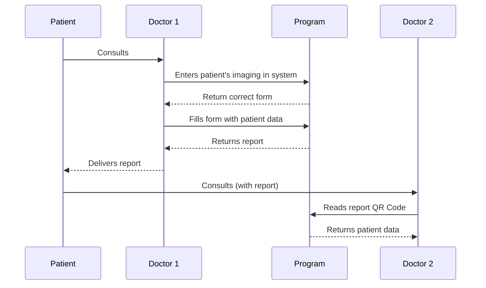

# MC426 👩‍⚕️ 
##### An Open-Source, Smart and Friendly Medical Report Generator

 [](https://codecov.io/gh/AndreisPurim/MC426)


## Technical Details
  

This project is separated into two modules: **Backend** and **Frontend**.
The Frontend is a static page hosted on [Github Pages](https://pages.github.com/) with the deploy being stored on the ```gh-deploy``` branch. Meanwhile, the Backend is deployed on a different AWS server and both communicate via APIs.

You can clone our repository on your machine using ```git clone git@github.com:AndreisPurim/MC426.git```

The frontend uses React with NPM and Material-UI for building UI components. React is a JavaScript library for creating reusable UI components, while Material-UI is a pre-built UI component library that follows Google's Material Design guidelines. You need [Node.js](https://nodejs.org/en) and [npm](https://docs.npmjs.com/downloading-and-installing-node-js-and-npm). 

Go to the Frontend folder using ```cd Frontend``` and install the packages if you have never done it before ```npm install```. Then you can run locally on your computer using ```npm run deploy```

You can deploy using ```npm run deploy```, which will automatically commit the build to ```gh-deploy```  and deploy on the website.
 


## Diagrams

> **New ideas:** contact the administrators



## Architecture
>Insert images here
### Architecture Style:
> **Single Page Application** - The choice for SPA is based on the intent to make the user experience simple, considering the application will need to be loaded only once, making the navigation easier and dynamic. In addition to that, SPA sinergyzes with React Virtual DOM, making the app rendering efficient and fluid.

>**RESTful APIs based on HTTP** - They are simple, widely supported, scalable, cacheable, and promote a uniform and stateless interface. They offer flexibility, have a large ecosystem of tools, and are the standard for web services.
 
### Design Pattern:
>**Observer** - The choice for the Observer design is based on its sinergy with SPA and the way React native behaviors with hooks and states, making the application dependencies/components easier to manipulate and control.

### Main components and responsabilities
- **Typescript and React**: TypeScript adds type safety and productivity, while React provides component-based architecture and efficient UI rendering. Together, they offer scalability, compatibility, and a rich ecosystem for web development
- **Pyhton and FastAPI**: Python is simple and has a large community. FastAPI is a high-performance web framework that leverages Python's strengths. It supports async programming, integrates well, and excels at API development and documentation. Together, they offer scalability, testing, and efficient development
- **Ormar**: Is a Python library that provides an Object-Relational Mapping (ORM) framework for asynchronous applications. It simplifies database access and modeling by allowing developers to define Python classes that map to database tables. It supports various databases and offers features like querying, relationships, and migration management. It integrates well with async frameworks like FastAPI and enables efficient and scalable development of database-driven applications. It is built on top of the SQLAlchemy core and supports various databases, including PostgreSQL, MySQL, SQLite, and others.
- **SQLAlchemy**: a Python library for working with databases using object-oriented concepts, including an ORM and powerful querying capabilities. It supports multiple databases, simplifies database interactions, and handles migrations
